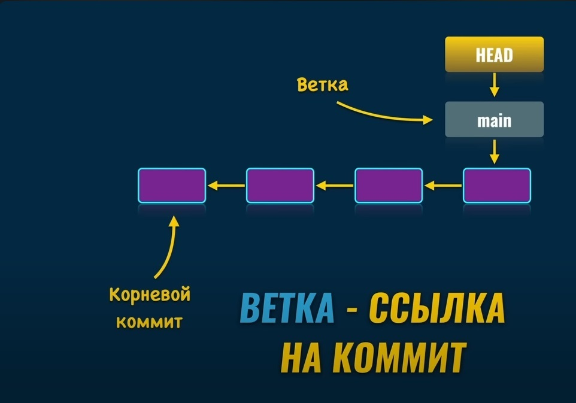

# Git

- [Git](https://git-scm.com/)
- [GUI clients](https://git-scm.com/download/gui/windows)
- [GitHub](https://github.com/)

1. `git --version` - перевірка версії
2. `git config --global user.name "AxirChaha"` - встановлюємо ім'я
3. `git config --global user.email "chahara.gm@gmail.com"` - email
4. `git config --global color.ui auto` - додає допоміжне забарвлення виводу

    - > Ім'я та email бажано робити таке ж як і на GitHab!

4. `git config --list` - перевіряємо налаштування git

## Робота з репозиторіями

 - `git init`- ініціалізація Git репозиторію у цій папці, за замовченням створюється гілка `master`
 - `touch "README.md"` - створюємо файл readme (обов'язково в лапках)
 - `git add README.md` - індексуємо файл 

або

 - `git add .` - індексуємо усі файли та папки
 - `git commit -m "first commit"` - додаємо перший чи нульовий коміт та переносимо усе в репозиторій Git
 - `git branch -M main` - перейменовуємо в `main`

### Гілка - Посилання - Коміт

### Команди Git

- `git status` - відображає поточний стан репозиторію
- `git add <files>` - підготовка, індексація файлу перед комітом
- `git add .` - підготовка, індексація файлів та папок перед комітом
- `git commit -m "<message>"` - коміт з записом
- `git log` - історія усіх комітов
- `git checkout <commit hash>` - перехід до вказаного коміта
- `git checkout <branch name>` - перехід до вказаної гілки
- `git cat-file -t <commit hash>` - читаємо тип об'єкту git по його hash (commit - коміт, tree - папка (дерево), blob - файл)
- `git cat-file -p <commit hash>` - читаємо вміст об'єкту git по його hash 
---
- `git branch <branch name>` - створюємо гілку
- `git checkout -b <branch name>` - створюємо гілку і одразу переходимо до неї
- `git branch` - список усіх гілок
- `git branch -m <new branch name>` - перейменовує поточну гілку
- `git checkout -d <branch name>` - видаляємо гілку (поточну гілку видалити неможливо!)

### Злиття гілок

- `git merge <feature branch name>` - злиття гілки `<feature branch name>` в поточну `<receiving branch>`

#### Покрокове злиття гілок

1. Ініціалізуємо репозиторій - `git init`
2. Створюємо (наприклад) файл - `touch README.mb`
3. Індексуємо - `git add README.mb`
4. Робимо перший коміт - `git commit -m "One commit branch main"`
5. Перейменовуємо основну гілку в `main` - `git branch -m main`
6. Створюємо нову гілку `two-branch` - `git branch two-branch`
7. Переходимо на неї - `git checkout two-branch`
8. Створюємо в ній (наприклад) файл - `touch temp.txt`
9. індексуємо - `git add .`
10. Робимо коміт у цій гільці - `git commit -m "One commit branch two-branch"`
11. Переходимо на основну гілку - `git checkout main`
12. Робимо злиття - `git merge two-branch`
    - Чи разом з повідомленням - `git merge -m "Merging two-branch into main" two-branch`
13. Видаляємо гілку `two-branch` - `git branch -d two-branch`
---

### Віддалений репозиторій

- `git clone <url>` - клонування віддаленого репозиторію
- `git branch -a` - відображає усі гілки включно з тими які знаходяться на віддаленому репозиторію
- `git pull` - завантаження та застосування змін з віддаленої гілки у локальну
- `git push` - завантажує зміни з локальної гілки на віддалену гілку репозиторію

---

- `git remote add origin <url>` - підключення віддаленого репозиторію
- `git push -u origin <branch>` - завантаження змін з локальної гілки в віддалену, зі створення зв'язку між ними 
- `git push` - після зв'язування є можливість завантажувати зміни на віддалену гілку репозиторію
- `git remote -v` - подивитися налаштування віддаленого сервера
- `git branch -vv` - показує зв'язок локальної з віддаленою гілками

---

### GitHub

- `ssh-keygen` - створюємо ssh ключ для GitHub
- Чи можливо створити токени для доступу, тоді - `git push -u origin main` - далі вводимо login та наданий ключ токена

